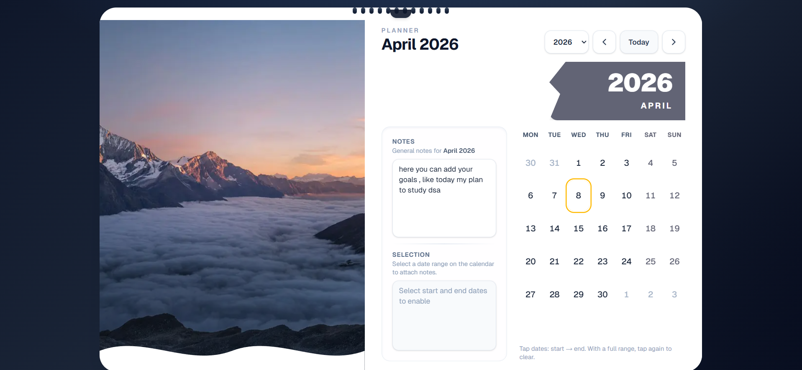
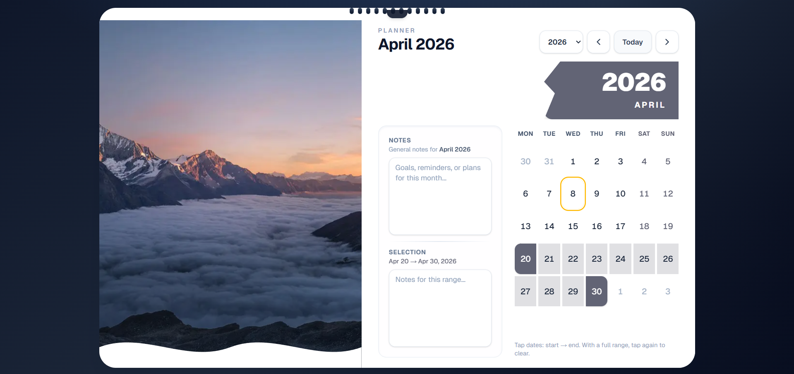
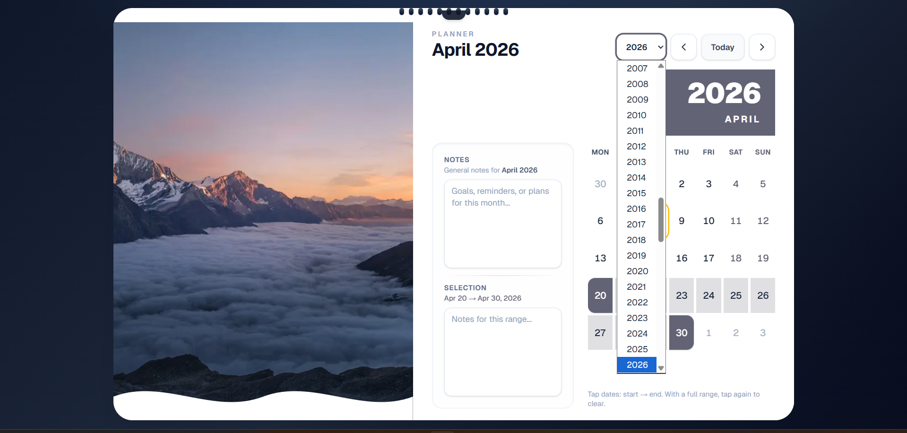
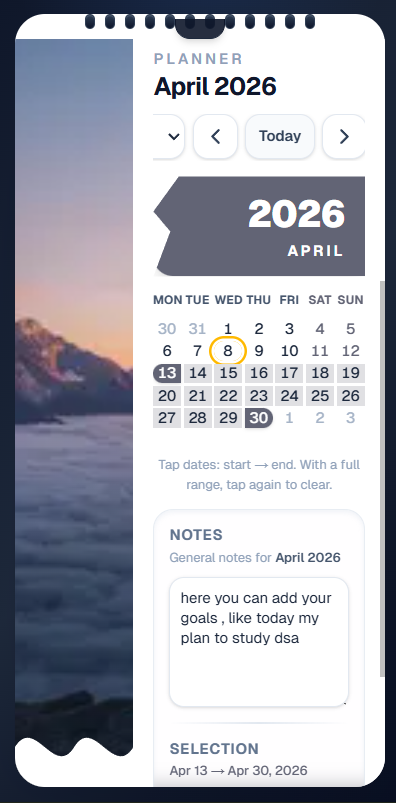
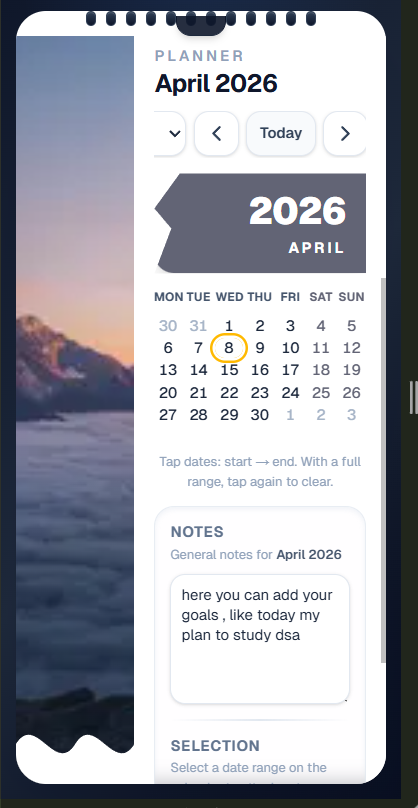

# Wall Calendar

Interactive wall-style calendar for planning: browse months, pick date ranges, and keep notes. Data stays in the browser via `localStorage`.

## Screenshots

| Desktop — hero image, notes, calendar, and month ribbon |
| --- |
|  |

| Desktop — date range selected on the grid |
| --- |
|  |

| Desktop — year dropdown and navigation |
| --- |
|  |

| Phone — stacked calendar, notes, and selection |
| --- |
|  |

| Phone — planner with notes filled in |
| --- |
|  |

Files under `docs/readme/` exist only so GitHub can render the images in this file; the app does not load them. GitHub needs those files in the repository (or public URLs) to show pictures here—there is no way to embed images in README from disk without hosting them somewhere Git can fetch. To avoid committing binaries, delete `docs/readme/*.png`, upload the same images elsewhere, and change each `](docs/readme/...` link to a full `https://...` URL.

## Features

- Month grid with Monday as the first day of the week, leading and trailing days from adjacent months, today highlighted, and weekend styling tied to the theme accent.
- Navigate with previous and next month, a year dropdown (1950–2080), and a Today control.
- Date range selection: first tap sets the start, second tap sets the end; a third tap clears the selection. Hovering shows a preview of the range before the end date is chosen.
- Monthly notes saved per calendar month and restored when you return to that month.
- Range notes saved per selected range (start and end dates) and loaded when that range is active again.
- Static US holiday labels for demo dates (see `src/utils/dateUtils.ts`).
- Hero image with the month ribbon tint sampled from the photo; range selection and controls use a fixed brand blue.
- Responsive layout: narrow viewports stack calendar and notes with scroll; wider viewports use a side-by-side grid. Hero strip keeps a minimum height on small screens so the image loads correctly with `next/image`.
- Month transitions use lightweight CSS animations.

## Tech Stack

| Area        | Details                          |
| ----------- | -------------------------------- |
| Framework   | Next.js 16 (App Router)          |
| UI          | React 19, TypeScript             |
| Styling     | Tailwind CSS 4                   |
| Dates       | date-fns 4                       |
| Fonts       | Geist (via `next/font`)          |

## Requirements

- Node.js 20 or newer recommended
- npm (or compatible package manager)

## Setup and Scripts

Install dependencies:

```bash
npm install
```

Run the development server:

```bash
npm run dev
```

Open [http://localhost:3000](http://localhost:3000).

Production build and local production server:

```bash
npm run build
npm start
```

Lint:

```bash
npm run lint
```

## Project Layout

| Path | Role |
| ---- | ---- |
| `src/app/` | App Router entry, layout, global styles |
| `src/components/Calendar.tsx` | Main calendar state, persistence, chrome |
| `src/components/CalendarGrid.tsx` | Week header and day grid |
| `src/components/DayCell.tsx` | Single day cell interactions and styles |
| `src/components/NotesPanel.tsx` | Monthly and range note editors |
| `src/utils/dateUtils.ts` | Grid building, range helpers, holiday map |
| `src/utils/colorUtils.ts` | Accent sampling from the hero image |
| `next.config.ts` | Remote image allowlist for Unsplash |
| `docs/readme/` | Images used only for this README on GitHub |

## Persistence

All keys are versioned. Clearing site data or a different browser profile starts fresh.

| Key | Contents |
| --- | -------- |
| `wall-calendar-monthly-notes-v1` | Map of `yyyy-MM` → monthly note text |
| `wall-calendar-range-by-month-v1` | Map of `yyyy-MM` → selected range for that month view |
| `wall-calendar-range-notes-v1` | Map of `yyyy-MM-dd|yyyy-MM-dd` → note for that range |

## Images

The hero uses a remote Unsplash URL. Allowed hosts are configured under `images.remotePatterns` in `next.config.ts`.


